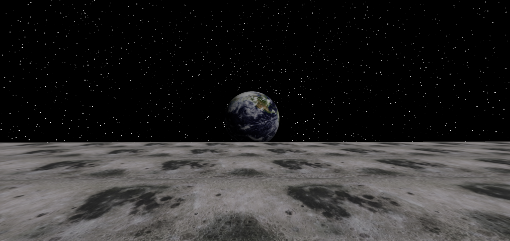

# 月面ワールド



XRift 向けの WebXR ワールド「月面ワールド」の実装です。月面を歩き回り、宇宙空間に浮かぶ地球を眺めることができます。

## ワールド概要

- パッケージ名: `@xrift/moon-surface`
- タイトル: `月面ワールド`
- 説明: 月面を歩き回り、宇宙空間に浮かぶ地球を眺めることができるワールドです
- スポーン位置: `[0, 0, 30]`

月面の地表、星空のスカイボックス、遠方に浮かぶ地球で構成されたシンプルな鑑賞・探索向けワールドです。

## 特徴

- 月面テクスチャを貼った広い地面を配置
- 地軸 23.5° の傾きと自転アニメーション付きの地球を表示
- カスタムシェーダーで描画する星空背景
- 月面向けの低重力設定 (`gravity: 1.62`)
- 無限ジャンプ有効 (`allowInfiniteJump: true`) により軽快に探索可能

## 技術スタック

- React 19
- TypeScript 5.6
- Vite 7
- Three.js
- @react-three/fiber
- @react-three/drei
- @react-three/rapier
- @xrift/world-components

依存関係の詳細は `package.json` を参照してください。

## セットアップ / 開発コマンド

### セットアップ

```bash
npm install
```

### 開発

```bash
npm run dev
```

ローカル開発では `http://localhost:5173` で確認できます。

### 利用する主なコマンド

```bash
# 開発サーバー
npm run dev

# 本番ビルド
npm run build

# ビルド結果の確認
npm run preview

# TypeScript 型チェック
npm run typecheck

# XRift CLI へログイン
xrift login

# XRift へアップロード
xrift upload world
```

`xrift upload world` を実行する前に、XRift CLI で `xrift login` を済ませておく必要があります。アップロード時は `xrift.json` の `world` 設定が参照され、`distDir`、`title`、`description`、`thumbnailPath`、`buildCommand` などが利用されます。

## ワールド構成 / 主要ファイル

- `src/World.tsx`
	- `SpawnPoint`、`ambientLight`、`directionalLight`、`MoonSurface`、`Earth`、`Skybox` を配置するメインシーンです。
- `src/index.tsx`
	- 本番公開用エントリーポイントです。XRift へ公開する `World` をここから export します。
- `src/components/MoonSurface/index.tsx`
	- 月面テクスチャの地面を表示します。`RigidBody` は固定で、地面サイズは `WORLD_CONFIG.width = 400`、`WORLD_CONFIG.depth = 200` です。
- `src/components/Earth/index.tsx`
	- 地軸 23.5° の傾きと自転アニメーションを持つ地球を表示します。
- `src/components/Skybox/index.tsx`
	- カスタムシェーダーで星空背景を描画します。
- `src/constants.ts`
	- ワールドサイズなどの定数を定義します。
- `src/dev.tsx`
	- 開発用エントリーポイントです。`XRiftProvider baseUrl="/"` と `DevEnvironment` を使ってローカル確認を行います。
- `vite.config.ts`
	- Module Federation の設定ファイルです。`./World` を `./src/index.tsx` から公開する設定を持ちます。
- `xrift.json`
	- ワールドのメタデータ、ビルド設定、物理設定を管理します。

## アセット説明

`public/` には以下のアセットを配置しています。

- `public/2k_moon.jpg`
	- 月面の地面テクスチャです。`MoonSurface` で使用します。
- `public/land_ocean_ice_cloud_2048.jpg`
	- 地球の表面テクスチャです。`Earth` で使用します。
- `public/thumbnail.png`
	- XRift 上で表示するワールドのサムネイル画像です。

XRift ではアセットを `public/` に置き、読み込み時は必ず `useXRift()` の `baseUrl` を使ってください。

```tsx
const { baseUrl } = useXRift()
const texture = useTexture(`${baseUrl}2k_moon.jpg`)
```

`baseUrl` には末尾の `/` が含まれるため、`${baseUrl}path` の形式で結合します。`${baseUrl}/path` は使わないでください。

## 物理設定 / xrift.json

`xrift.json` ではワールド公開時のメタデータと、プレイヤー挙動に関わる物理設定を管理しています。

```json
{
	"physics": {
		"gravity": 1.62,
		"allowInfiniteJump": true
	}
}
```

- `gravity: 1.62`
	- 月面を意識した低重力設定です。
- `allowInfiniteJump: true`
	- 開発時や探索時に移動しやすいよう、無限ジャンプを有効にしています。

あわせて `world.title`、`world.description`、`world.thumbnailPath`、`world.buildCommand` などの XRift 用メタデータもここで定義しています。

## 開発メモ / 注意事項

- アセット読み込みは必ず `useXRift()` の `baseUrl` を使用してください。
- `baseUrl` は末尾に `/` を含むため、`${baseUrl}path` で連結してください。
- ローカル開発時は `src/dev.tsx` で `XRiftProvider baseUrl="/"` を使っています。本番公開時は `src/index.tsx` から export した `World` が利用され、XRift 側の配信パスに応じた `baseUrl` が提供されます。
- 月面の地面は固定 `RigidBody` なので、地形を変更する場合は見た目だけでなく当たり判定への影響も確認してください。
- 地球は `src/World.tsx` で北方向の空側に配置しています。見え方を変える場合はスポーン位置との関係も合わせて調整してください。

## ライセンス

MIT

